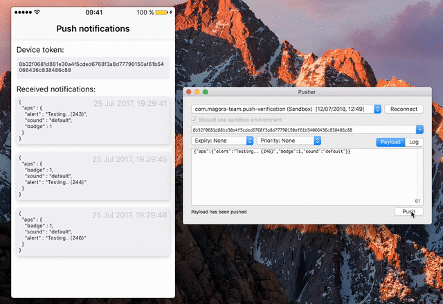

# push-verification

### Overview

`push-verification` is an iOS application to test push notifications.

### Features
* Display device token
* Share device token using standard Sharing dialog
* Display received notifications
   * Payload
   * Date
* Keep notifications between application restarts

### Localization

Localization is located in [Google Sheet](https://goo.gl/k3Bgx9) and
generated by [sheet-localization](https://github.com/Magora-IOS/sheet-localization)

